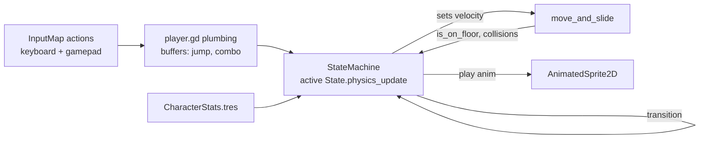
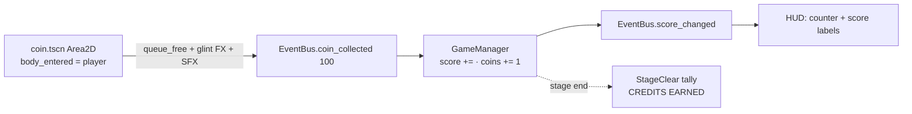
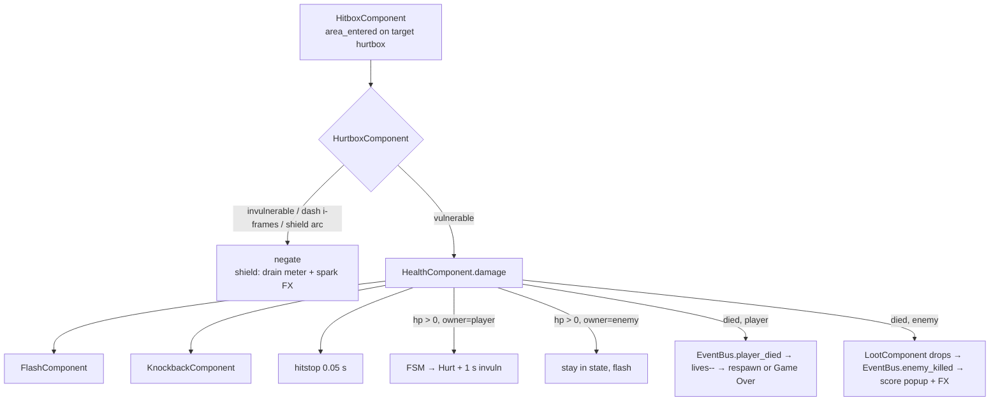
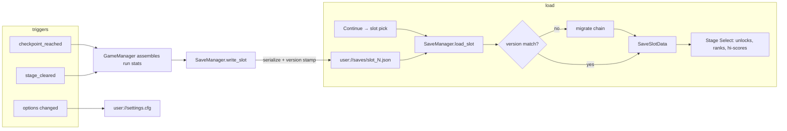
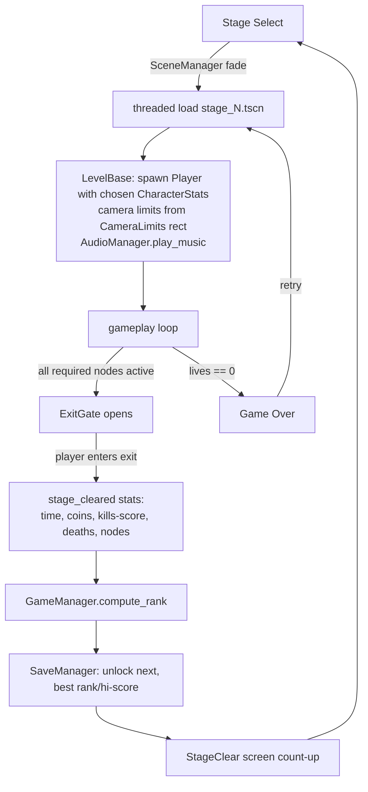

# Data Flow Diagrams

## 1. Input → Movement (every physics frame)

## 2. Coin pickup → HUD/score

## 3. Damage pipeline (both directions)

## 4. Save / Load

## 5. Stage lifecycle

**Contract summary:** gameplay objects write to `EventBus`; `GameManager` is the only aggregator; `SaveManager` is the only disk-toucher; UI only reads. No object polls another object's state across systems.
