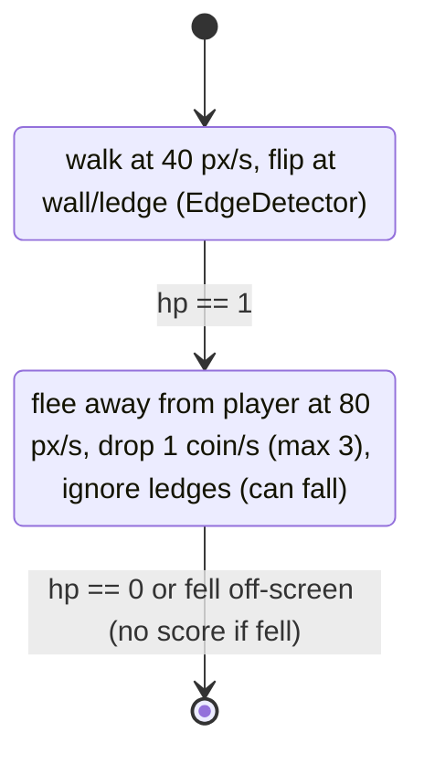
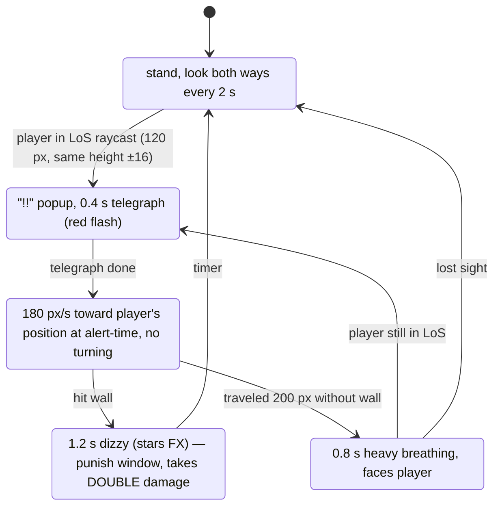
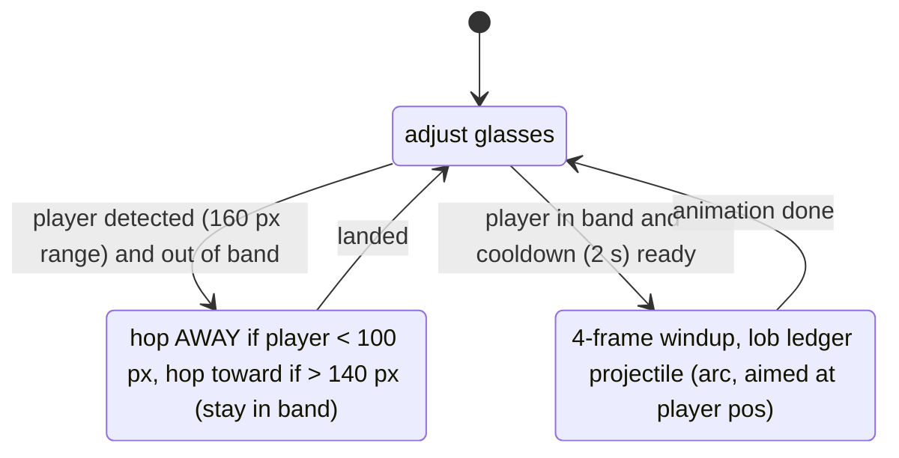
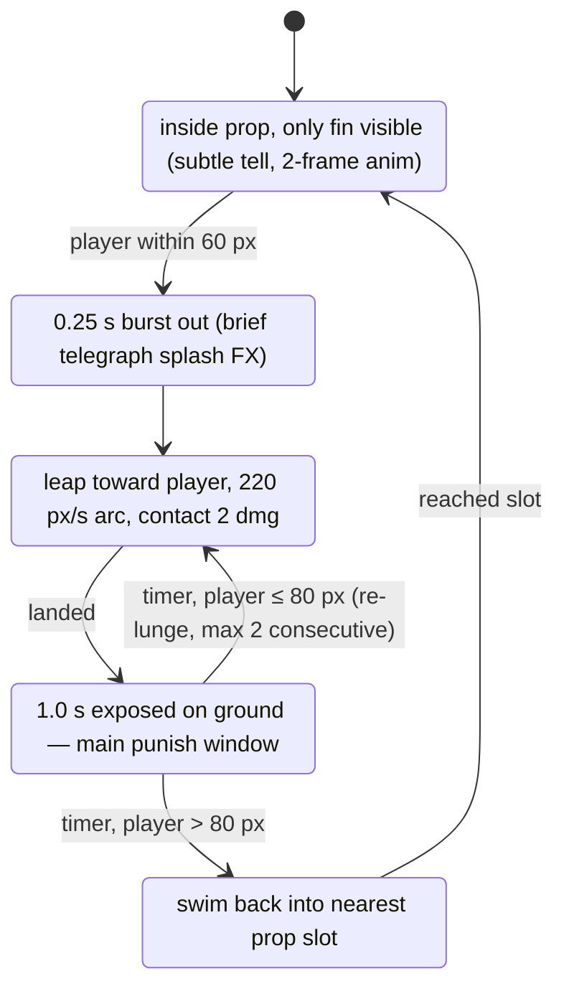
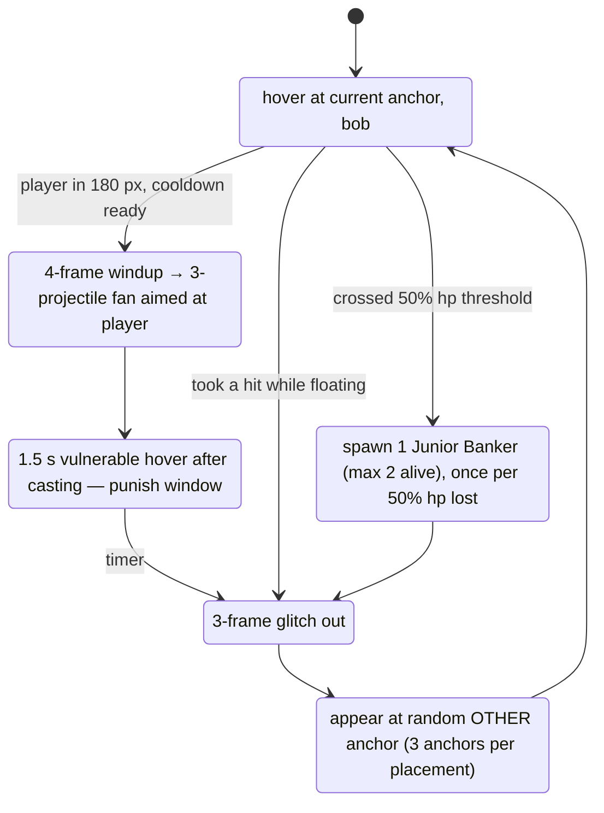
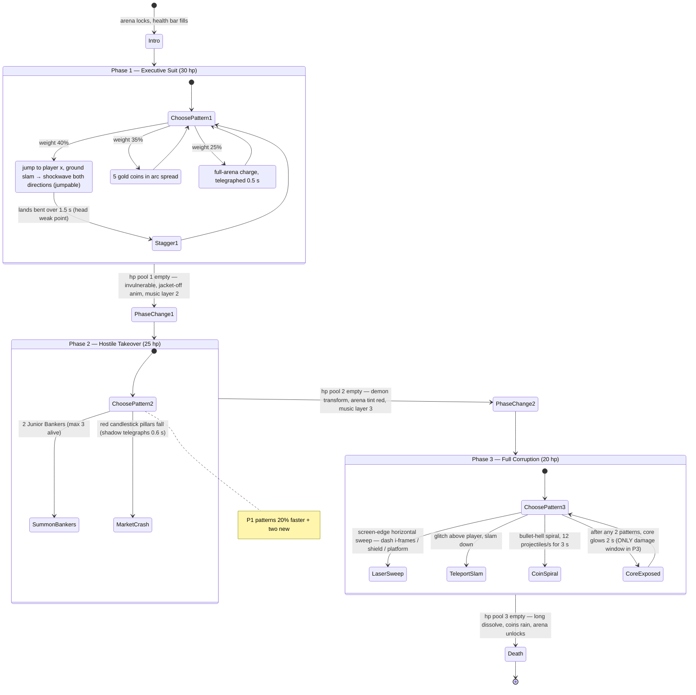

# Enemy AI — State Diagrams

All enemies run the shared `StateMachine`. Off-screen enemies sleep (`VisibleOnScreenEnabler2D`). Every enemy has implicit transitions: `(hurt received) → Hurt` (0.2 s flash + knockback, then back to previous state) and `(hp == 0) → Death` (play death, spawn loot via LootComponent, emit `enemy_killed`, free). Diagrams show behavior states only.

## Junior Banker — nervous patroller

Stompable. Contact 1 dmg. The comedy enemy — panic yelp SFX, briefcase flails.

## Angry Manager — sight-triggered charger

## Auditor — spacing ranged

NOT stompable (spiked ledger hat — stomping hurts player). Projectile despawns on wall/2.5 s.

## Loan Shark — ambusher

Only vulnerable outside Hidden (hurtbox disabled while hidden).

## Corrupted AI Banker — teleport caster (also S2 mid-boss with 2× HP)

## Regional Manager (S3 mid-boss) — elite Angry Manager

Same FSM as Angry Manager plus: `DeskThrow` state between cooldowns (arcing desk projectile, breaks on ground into 2 paper hazards, 3 s), 12 HP, charge 220 px/s, WallStun shortened to 0.8 s after half HP.

## CEO Boss — "The Chairman" (3 phases via PhaseManager)

Boss HP bar: segmented bottom bar, refills per phase (classic arcade). All boss projectiles pooled. Every pattern has ≥ 0.4 s visual telegraph — **no unreactable hits**.

## Shared tuning table (in `data/enemies/*.tres`)

| Enemy | HP | Speed | Detect | Cooldown |
|---|---|---|---|---|
| Junior Banker | 2 | 40/80 | — | — |
| Angry Manager | 4 | 180 charge | 120 LoS | 0.8 |
| Auditor | 3 | 60 hop | 160 | 2.0 |
| Loan Shark | 5 | 220 lunge | 60 | 1.0 |
| AI Banker | 8 (16 midboss) | — | 180 | 2.5 |
| Regional Manager | 12 | 220 | 140 | 0.6 |
| CEO | 30/25/20 | varies | arena | pattern-driven |
