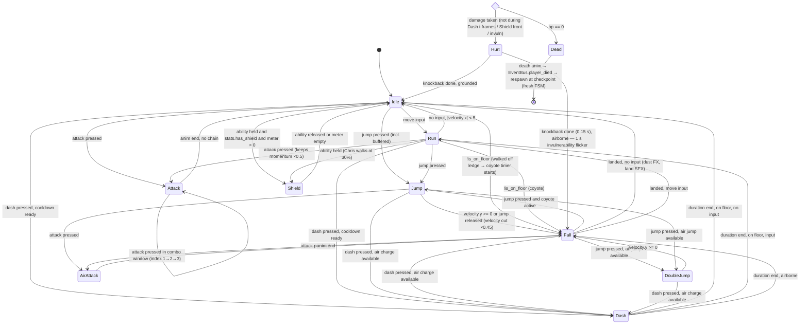

# Player Finite State Machine

One FSM serves both characters; `CharacterStats` gates Chris/Flam differences (`has_shield`, `air_dash_charges`, `dash_has_iframes`). **Wall slide/jump: CUT for v1.0** — level design never requires it; revisit post-launch if stages feel starved for verticality.

## Diagram

## State responsibilities

| State | enter() | physics_update() | exit() |
|---|---|---|---|
| `Idle` | play `idle` | friction to 0; check transitions | — |
| `Run` | play `run` | accel toward input ×run_speed; flip sprite | — |
| `Jump` | play `jump`, vy = jump_velocity, SFX, consume buffer | air control; variable-height cut on release | — |
| `DoubleJump` | play `double_jump`, vy = double_jump_velocity, consume air jump | air control | — |
| `Fall` | play `fall`; start coyote if from ground | fall gravity, clamp max_fall; landing check | stop coyote |
| `Dash` | play `dash`, lock velocity = facing × dash_speed, gravity off, i-frames if stats say, ghost spawner on, SFX | fixed velocity; end on timer/wall | gravity on, start cooldown, consume air charge if airborne |
| `Attack` (1–3) | play `attack_N`; AnimationPlayer keys hitbox frames | halt ×0.5 momentum decay; buffer next press | disable hitbox, combo window timer |
| `AirAttack` | play `air_attack`, keep air control | normal air physics | disable hitbox |
| `Shield` | play `shield`, enable ShieldVisual+Area, walk 30 % | drain meter; block = negate frontal hits (HurtboxComponent checks shield arc ±60°) | disable, start regen delay |
| `Hurt` | play `hurt`, flash, knockback impulse, SFX, 1 s invuln start | decay knockback | — |
| `Dead` | play `death`, disable hurtbox, emit `player_died` | none (input ignored) | — |

## Shared per-frame plumbing (in `player.gd`, not states)

- Gravity application (rise vs fall constant) — except Dash (off) and Dead.
- Timer updates: coyote, jump buffer (set on press regardless of state), dash cooldown, shield regen.
- `move_and_slide()` always last.
- Hazard/one-way platform checks; moving-platform velocity inheritance (Godot handles via floor snap; verified in tests).
- Air-jump + air-dash charges reset on `is_on_floor()`.

## Buffers & grace (the "feel" layer — values in CharacterStats)

| Mechanic | Behavior |
|---|---|
| Jump buffer 0.12 s | Press stored; fires on next valid ground/coyote frame |
| Coyote 0.10 s | Ground-jump allowed after leaving ledge |
| Combo buffer 0.35 s | Attack press during a swing queues next combo hit |
| Dash buffer | Not buffered (deliberate — dash is a commitment) |
| Land assist | Landing within 2 px of ledge edge nudges player onto it |
