# UML Class Diagram

```mermaid
classDiagram
    direction TB

    %% ===== Autoloads =====
    class EventBus {
        <<autoload>>
        +signal coin_collected(value)
        +signal player_damaged(hp, max_hp)
        +signal player_died()
        +signal enemy_killed(score, world_pos)
        +signal node_activated(id, count, total)
        +signal checkpoint_reached(id)
        +signal stage_cleared(stats)
        +signal score_changed(score)
        +signal boss_phase_changed(phase)
        +signal pause_toggled(paused)
    }
    class GameManager {
        <<autoload>>
        -_score int
        -_lives int
        -_coins int
        -_character StringName
        -_stage_id int
        +start_stage(stage_id, character)
        +get_score() int
        +compute_rank(stats) Rank
    }
    class SaveManager {
        <<autoload>>
        -_active_slot int
        +load_slot(i) SaveSlotData
        +write_slot(i, data)
        +delete_slot(i)
        +save_settings() / load_settings()
        -_migrate(dict, from_version) Dictionary
    }
    class AudioManager {
        <<autoload>>
        +play_music(track, crossfade)
        +play_sfx(name, jitter)
        +set_bus_volume(bus, linear)
    }
    class SceneManager {
        <<autoload>>
        +change_scene(path)
        +reload_current()
        -_fade(in_out)
    }

    GameManager ..> EventBus : subscribes
    GameManager ..> SaveManager : persists via

    %% ===== FSM =====
    class StateMachine {
        +initial_state NodePath
        -_current State
        +transition(name StringName)
        +signal state_changed(from, to)
    }
    class State {
        <<abstract>>
        #body CharacterBody2D
        #stats Resource
        +enter(prev) / exit()
        +physics_update(delta)
        +input(event)
    }
    StateMachine o-- "1..*" State

    %% ===== Components =====
    class HealthComponent {
        +max_hp int
        +hp int
        +damage(n) / heal(n)
        +signal damaged / healed / died
    }
    class HurtboxComponent {
        +invulnerable bool
        +start_invuln(sec)
        +signal hurt(hitbox)
    }
    class HitboxComponent {
        +damage int
        +knockback float
    }
    class KnockbackComponent
    class FlashComponent
    class LootComponent {
        +loot_scene PackedScene
        +count int
    }
    class EdgeDetectorComponent {
        +is_wall_ahead() bool
        +is_ledge_ahead() bool
    }
    class PlayerDetectorComponent {
        +range float
        +signal player_spotted(player)
    }
    HurtboxComponent ..> HitboxComponent : receives
    HurtboxComponent ..> HealthComponent : forwards damage

    %% ===== Entities =====
    class Player {
        <<CharacterBody2D>>
        +stats CharacterStats
        +facing int
        +air_jumps_left int
        +dash_charges_left int
        +shield_meter float
    }
    class EnemyBase {
        <<CharacterBody2D>>
        +stats EnemyStats
        #die()
    }
    class BossBase {
        +phase_manager PhaseManager
    }
    class PhaseManager {
        +phases Array[PhaseConfig]
        +signal phase_started(i)
    }
    Player *-- StateMachine
    Player *-- HealthComponent
    Player *-- HurtboxComponent
    Player *-- HitboxComponent : melee
    Player *-- KnockbackComponent
    EnemyBase *-- StateMachine
    EnemyBase *-- HealthComponent
    EnemyBase *-- HurtboxComponent
    EnemyBase *-- HitboxComponent : contact
    EnemyBase *-- LootComponent
    EnemyBase <|-- BossBase
    BossBase *-- PhaseManager

    %% ===== Resources =====
    class CharacterStats {
        <<Resource>>
        +max_hp, run_speed, jump_velocity, ...
        +has_shield bool
        +air_dash_charges int
        +dash_has_iframes bool
    }
    class EnemyStats {
        <<Resource>>
        +max_hp, contact_damage, score_value, ...
        +stompable bool
    }
    class LevelData {
        <<Resource>>
        +stage_id, par_time_sec, total_coins, node_count, music, next_stage_id
    }
    Player ..> CharacterStats
    EnemyBase ..> EnemyStats

    %% ===== Level =====
    class LevelBase {
        <<Node2D>>
        +data LevelData
        +active_checkpoint_id int
        +respawn_player()
    }
    class Checkpoint
    class SecurityNode
    class HiddenRoom
    class MovingPlatform {
        <<AnimatableBody2D + PathFollow2D>>
    }
    class ExitGate {
        +required_nodes int
    }
    LevelBase o-- Checkpoint
    LevelBase o-- SecurityNode
    LevelBase o-- HiddenRoom
    LevelBase o-- MovingPlatform
    LevelBase o-- ExitGate
    LevelBase o-- Player : spawns
    LevelBase o-- EnemyBase : contains
    Checkpoint ..> EventBus : emits
    SecurityNode ..> EventBus : emits
    ExitGate ..> EventBus : listens node_activated

    %% ===== UI =====
    class HUD {
        <<Control>>
        listens: player_damaged, coin_collected, score_changed, node_activated
    }
    class StageClearScreen {
        +show_tally(stats)
    }
    class ObjectPool {
        +acquire() Node
        +release(node)
    }
    HUD ..> EventBus
    StageClearScreen ..> GameManager : rank
```

**Key relationships:** entities own components (composition, diamond); nothing references a level or UI directly — all cross-cutting flows ride `EventBus` (dashed). Only inheritance: `State` subclasses and `EnemyBase → BossBase`. Adding enemy #7 = new scene inheriting `enemy_base.tscn` + new state scripts + one `EnemyStats.tres` — zero edits to existing code.
